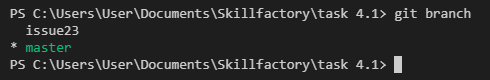

[Содержание](./readme.md)

## Создание веток – `git branch`

Иногда (почти всегда) для решения какой-то отдельной проблемы или задачи удобнее (лучше) создать новую ветку в проекте, чтобы не испортить работающий код в процессе работы.

Обычно такие ветки называются в соответствии с задачей (issue), функционалом, который планируется добавить (feature) или проблемой, которую нужно решить (bugfix, hotfix).

Чтобы создать новую ветку в проекте существует команда `git branch`.

```
git branch `название новой ветки`
```

Вызов команды без параметров выведет список существующих веток.



Git всегда показывает в какой из веток вы сейчс находитесь. Так, например, ветка issue23 была создана, но мы всё ещё находимся в ветке **master**. Чтобы сменить ветку необходимо использовать команду [`git checkout`](./checkout.md). С помощью этой команды можно и создавать ветки. Но об этом в следующей главе.

<table width="100%">
<td width="50%">

[<Скачивание изменений на локальный репозиторий – git pull](./pull.md)

</td>
<td style="text-align:right">

[Перемещение между ветками и коммитами – git checkout>](./checkout.md)

</td>
</table>