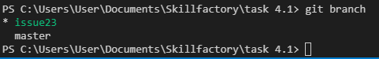
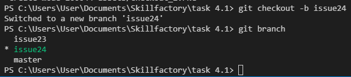
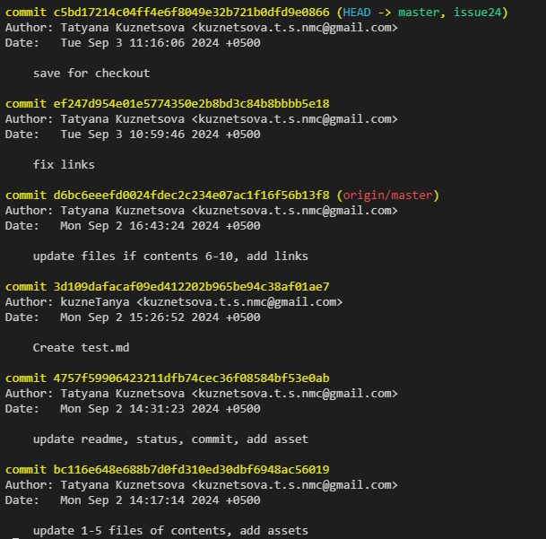
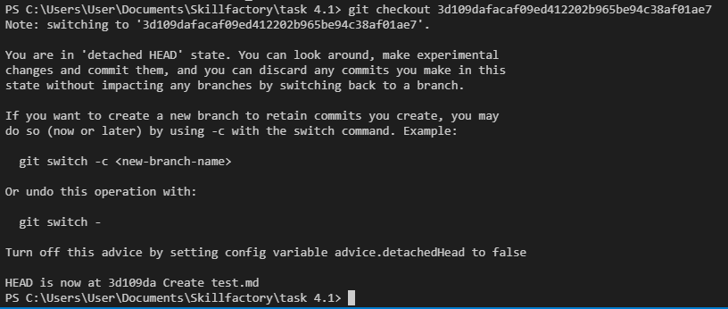

[Содержание](./readme.md)

## Перемещение между ветками и коммитами – `git checkout`

`git checkout` – это одна из универсальных команд Git-а, которая используется довольно часто, если работа ведется в проекте, в котором предусмотрено наличие нескольких веток. С помощью `git checkout` можно перемещаться по всему проекту. И даже между коммитами.

1. ### Переключение между ветками.

С помощью `git checkout` можно быстро перемещаться между ветками, созданными в проекте. Например, вы создали ветку, чтобы решить поставленную задачу (<span style="color:#00a86b">issue23</span>), но в процессе обнаружили, что нужно вернуться в основную ветку и быстро изменить какую-то строчку в коде, а после вернуться обратно.

В [прошлой главе](./branch.md) мы создали ветку issue23, но не переместились туда, оставшись в ветке <span style="color:#00a86b">master</span>. Чтобы начать работу над задачей в другой ветке необходимо выполнить следующую команду.

```
git checkout issue23
```

После выполнения данной команды мы окажемся в ветке <span style="color:#00a86b">issue23</span>, в которой сохраняется состояние нашего проекта на момент создания ветки.

Обратите внимание, что сохраняется то состояние, которое было в последнем коммите! Если ветка была создана после того, как некоторые изменения были внесены в проект, но не закоммичены, то эти изменения останутся только в главной ветке.



***
2. ### Создание новой ветки и перемещение в неё.

С помощью `git checkout` можно и создавать ветки, мгновенно переключаясь на неё. Для этого существует флаг `-b`, который и позволяет создавать новую ветку (branch).

```
git checkout -b issue24
```



***

3. ### Перемещение между коммитами.

`git checkout` используется не только для переключения между ветками, но и для путешествия по дереву коммитов. Предположим, что вам необходимо посмотреть на состояние проекта в определенный момент времени, но откатывать все совершенные изменения слишком затратно. Для этого можно использовать `git checkout`.

Для начала вызовем [журнал коммитов](./log.md).



И найдём коммит, в котором был создан `test.md`. Для того, чтобы переместиться туда, нужно копировать хэш коммита и добавить его к команде `git checkout`.

```
git checkout 3d109dafacaf09ed412202b965be94c38af01ae7
```



Переключение произошло, мы оказались в том коммите, который был нужен. И Git любезно предлагает нам осмотреть всё, поэкспериментировать как мы хотим, так как все изменения можно будет отменить одной простой командой, которая и вернет нас в привычное положение.

```
git switch -
```


<table width="100%">
<td width="50%">

[<Создание веток – git branch](./branch.md)

</td>
<td style="text-align:right">

[Скачивание изменений на локальный репозиторий – git fetch>](./fetch.md)

</td>
</table>