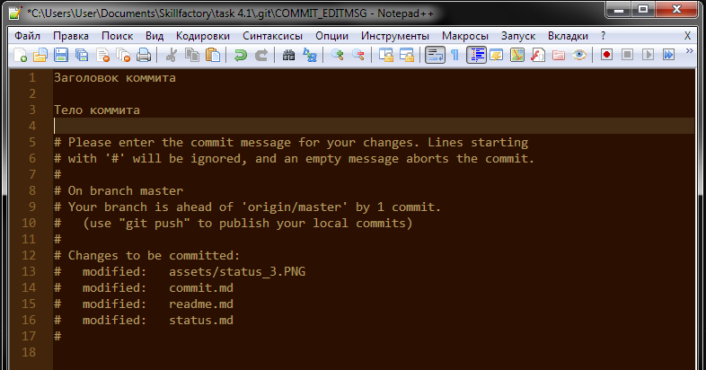

[Содержание](./readme.md)

## Фиксация изменений – `git commit`

После того, как изменения были проиндексированы их надо зафиксировать – сделать снимок состояния репозитория. Для этого существует команда `git commit`.

Коммит можно сделать двумя способами. 

+ командой в одну строку с коротким сообщением:

```
git commit -m "Информация о коммите"
```

где `-m` – это флаг, который позволяет оставить это короткое сообщение.

+ короткой командой, которая откроет текстовый редактор:

```
git commit
```




Обычно коммит оформляется в коротком варианте, с указанием только небольшого сообщения о том, какие изменения были внесены. Более подробное описание зачастую является излишним.

Кроме того, существует определенное правило оформления коммитов:

> действие -> наименование файла/модуля/задачи

Например, "update readme.md", "add calc function", "fix bug in func.php" и т.д. Это нужно, чтобы можно было легко ориентироваться по дереву коммитов и иметь возможность исправить изменения, которые понесли за собой ещё больше ошибок.


<table width="100%">
<td width="50%">

[<Индексация изменений – git add](./add.md)

</td>
<td>

<div style="text-align:right">

[Журнал коммитов – git log>](./log.md)

</div>

</td>
</table>