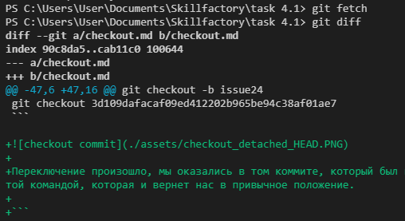

[Содержание](./readme.md)

## Скачивание изменений на локальный репозиторий – `git fetch`

Заголовок может быть знакомым, ведь то же самое рассказывалось в главе, посвященной [`git pull`](./pull.md).

Но `git fetch` всё же имеет определенную особенность в сравнении с `git pull`. `git fetch` тоже притягивает изменения из удаленного репозитория, но не производит слияния, как делает это `git pull`, давая возможность сначала ознакомиться с внесенными изменениями, а только потом производить слияние.

```
git fetch 
```

С помощью этой команды можно обновить только одну ветку, не затрагивая остальные.

```
git fetch origin master
```

После этого можно использовать команду `git diff`, чтобы ознакомиться с изменениями.



[Слияние веток – git merge>](./merge.md)
