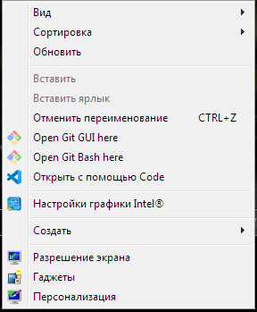

[Содержание](./readme.md)

## Установка Git for Windows

Так как Git изначально был создан и спроектирован для работы в Linux создателем Linux Линусом Торвальдсом, то для операционной системы Windows пришлось придумать свой способ установки Git.

Для того, чтобы установить Git на свой ПК с OS Windows необходимо перейти по ссылке официального сайта [Git](https://git-scm.com) и скачать оттуда установочный файл [Git for Windows](https://git-scm.com/download/win).

***
### Проверка наличия Git

Перед тем, как начать установку можно проверить наличие версии Git на вашем ПК. Для этого в командной строке необходимо ввести команду `git --version`.

Командную строку можно вызвать с помощью окна "Выполнить".
```
Win + R
```


Введите корроткую аббревиатуру `cmd` и нажмите "ОК". Перед вами откроется окно командной строки Windows. 

Вместо командной строки Windows ожно использовать PowerShell или терминал в любом IDE, в котором вы работаете.


***

## Установка Git

Если Git у вас отсутствует, запустите скачанный .exe файл и следуйте указаниям. Не нужно бояться английского языка в установочнике. Git работает на пользователя, а не против него. Можно просто нажимать всё время "Далее" и установка пройдёт без проблем. Если же у вас хорошее знание языка, можете изучить предлагаемые опции и выбрать то, что нужно вам.

Например, выбрать подходящий для вас редактор (vim, Nano, Wordpad и т.д.). Для меня удобнее всего использовать Notepad ++.


После завершения установки в контекстном меню у вас появится возможность запускать Git Bash или Git GUI в любой директории, которую вы захотите превратить в репозиторий.



[Создание локального репозитория – git init>](./init.md)
