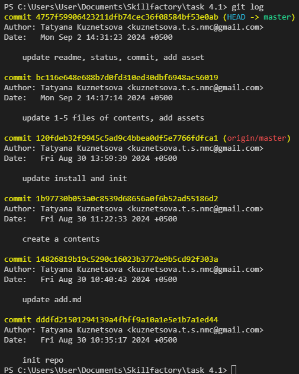

[Содержание](./readme.md)

## Журнал коммитов – `git log`

В течение длительной работы над проектом в системе может сохраниться невообразимое количество коммитов. Особенно, если работа ведется в разных ветках для решения разных программ.

Журнал коммитов позволяет легко ориентироваться во всех внесенных изменениях, а также помогает перемещаться среди коммитов, не вынуждая нас заучивать наизусть огромный 36-знаковый хэш нужного коммита.

По журналу можно легко проследить и наше местоположение относительно удаленного репозитория (`origin/master`). Так, например, отлично видно, что **HEAD** находится на локальной ветке **master**, а удаленная ветка **origin/master** отстает на два коммита.

Также, благодаря журналу, можно легко перемещаться по коммитам, возвращаясь в то или иное состояние. Об этом подробнее в главе ["Перемещение между ветками и коммитами – git checkout"](./checkout.md).

<table width="100%">
<td width="50%">

[<Фиксация изменений – git commit](./commit.md)

</td>
<td>

[Статус репозитория – git status>](./status.md)

</td>
</table>