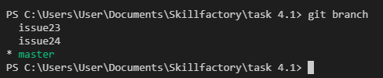
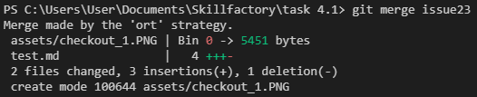
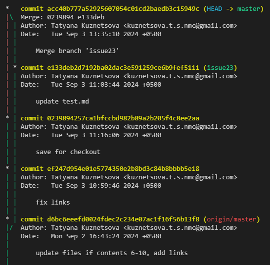

[Содержание](./readme.md)

## Слияние веток – `git merge`

Когда вы закончили работу с задачей в ветке <span style="color:#00a86b">issue23</span> нужно внести полученное решение в главну ветку <span style="color:#00a86b">master</span>. Для этого подходят две команды: `git merge` и [`git rebase`](./rebase.md).

`git merge` всегда вызывается из той ветки в которую нужно произвести слияние. Поэтому первым делом необходимо убедиться, что мы действительно находимся на ветке <span style="color:#00a86b">master</span>.



Теперь запустим команду и объединим нашу ветку с веткой <span style="color:#00a86b">issue23</span>.

```
git merge issue23
```



Суть слияния *merge* состоит в том, что прежняя ветка всё ещё остается в истории. Объединение происходит только на последнем коммите. Git находит общего предка двух веток, смотрит изменения, которые были произведены, и собирает из них один общий коммит. Иногда могут возникать конфликты, если были затронуты одни и те же файлы или строки. 

Чтобы нагляднее увидеть в каком состоянии у нас сейчас находится журнал коммитов, можно запустить команду `git log` с флагом `--graph`.

```
git log --graph
```



Таким образом можно проследить, как произошло слияние двух веток, в какой момент проект разветвился и т.д. Данное изображение выглядит чуть более информативным, чем стандартное представление журнала.

[Перебазирование коммитов и веток – git rebase>](./rebase.md)
