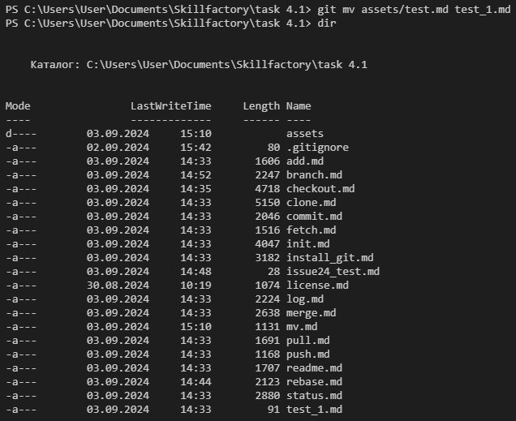

[Содержание](./readme.md)

## Перемещение или переименование фалов и директорий – `git mv`

Команда `git mv` предназначена для перемещения файлов и директорий (*mv* – сокращение от *move*). Но Git позволяет использовать эту команду и для переименования.

Перенесем файл `test.md` в директорию проекта `assets`.

```
git mv test.md assets/test.md
```

И проверим случилось ли перемещение.


Всё верно, test.md теперь находится в нужной папке. Но что с переименованием?

Чтобы переименовать файл нужно просто указать в качестве пункта назначения нужное наименование.

```
git mv assets/test.md test_1.md
```



Готово! Файл вернулся обратно и с новым названием. 

Впрочем, перемещать файд для его переименовывания не обязательно. Можно "переместить" его и внутри одной директории.

```
git mv test_1.md test_2.md
```


[На главную страницу](./readme.md)
