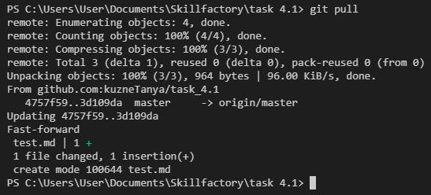
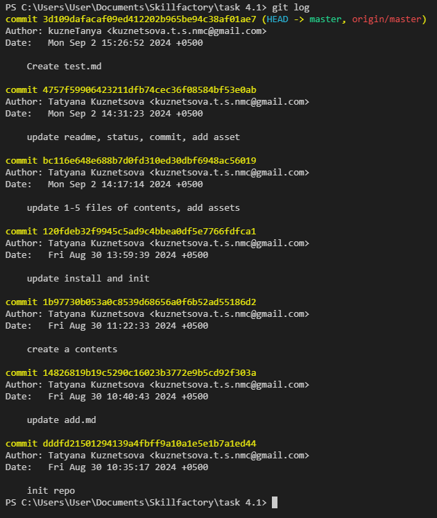

[Содержание](./readme.md)

## Скачивание изменений на локальный репозиторий – `git pull`

Представим ситуацию, при которой вы работаете над проектом не в одиночестве. Либо, например, по какой-то причине нужно было создать какой-то файл непосредственно на удаленном репозитории. Тогда для того, чтобы не перекрыть существующие изменения и синхронизировать удаленный и локальный репозитории необходимо "притянуть" к себе все внесенные изменения.

Для этого существует команда `git pull`.

```
git pull
```



На данном скриншоте видно, что после выполнения команды `git pull` в локальный репозиторий был добавлен файл **test.md**.

И, если взглянуть на дерево коммитов, то мы увидим ещё один коммит, который был добавлен из удаленного репозитория – *"Create test.md"*.



<table width="100%">
<td width="50%">

[Отправка изменений на удаленный репозиторий – git push](./push.md)

</td>
<td>

<div style="text-align:right">

[Создание веток – git branch>](./branch.md)

</div>

</td>
</table>