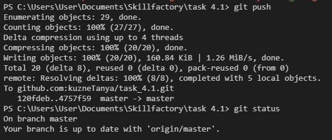

[Содержание](./readme.md)

## Отправка изменений на удаленный репозиторий – `git push`

После того, как все изменения были проиндексирвоаны ([`git add`](./add.md)) и зафиксированны ([`git commit`](./commit.md)) можно отправлять даные на удаленный репозиторий, чтобы синхронизировать его состояние с локальным.

```
git push
```



Запустив [`git status`](./status.md) после использования `git push` мы можем увидеть, что наша локальная ветка теперь синхронизирована с удаленной веткой <span style="color:#A52A2A">**origin/master**</span>.

<table width="100%">
<td width="50%">

[Статус репозитория – git status](./status.md)

</td>
<td style="text-align:right">

[Скачивание изменений на локальный репозиторий – git pull>](./pull.md)

</td>
</table>