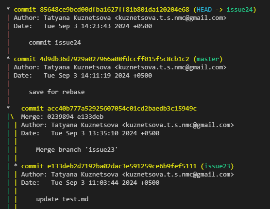

[Содержание](./readme.md)

## Перебазирование коммитов и веток – `git rebase`

`git rebase` действует похожим образом, как и [`git merge`](./merge.md). Но в отличие от *merge* *rebase* не просто сливает ветки, но и перебазирует их, создавая новую историю коммитов, при которой все они просто идут друг за другом. Как будто никакого ответвления и не было.

Сделаем в качестве примера rebase ещё одной побочной ветки – **issue24**. Для этого нужно переместиться в ветку issue24 и запустить процесс перебазирования.

```
git checkout issue24
git rebase master
```

Если никаких конфликтов не возникнет, перебазирование пройдёт спокойно. Останется только взглянуть на журнал в результате данной операции.



И здесь мы видим, что коммит ветки **issue24** просто встроился в общую ветку **master**, как будто никакого разветвления и не было.

Однако, нужно помнить, что *rebase* – это довольно опасная операция, если в одном проекте работает несколько человек. Если не разрешить конфликт верно, то можно потерять все наработки, которые будет крайне трудно восстановить.

[Перемещение или переименование фалов и директорий – git mv>](./mv.md)
