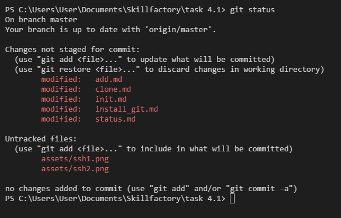
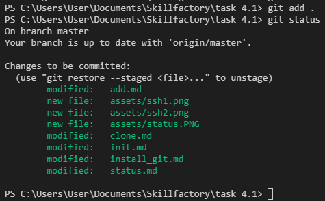
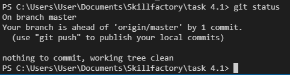

[Содержание](./readme.md)

## Статус репозитория – `git status`

Для проверки состояния вашего репозитория существует команда `git status`. При вызове этой команды, Git предоставляет информацию обо всех изменениях, которые были внесены с момента последнего коммита.

Например, на данном скриншоте Git сообщает нам о двух типах изменений состояния репозитория с момента последнего коммита.

> Changes not staged for commit:

Буквально: изменения, которые не приготовлены для коммита. 
Это те изменения, которые ещё не были проиндексированы ([`git add`](./add.md)). Статус *modified* напротив каждого файла означает, что они были каким-то образом изменены.

> Untracked files:

Буквально: неотслеживаемые файлы.
То есть, данные файлы не были ранее добавлены в репозиторий.

Чтобы изменить статус репозитория, нужно проиндексировать все изменения с помощью [`git add`](./add.md). Теперь информация будет выглядеть иначе.

Теперь все изменения отмечены зеленым цветом, что означает, что они готовы к тому, чтобы отправиться в коммит. Об этом же свидетельствует надпись:
> Changes to be committed:

Буквально: изменения, готовые стать закоммиченными.

Теперь, если добавить коммит со всеми внесенными изменениями, `git status` выведет простое сообщение о том, что наша ветка **master** находится дальше, чем удаленный репозиторий (`origin/master`) на 1 коммит.

А также уведомит о том, что больше нечего коммитить, никаких изменений не наблюдается.

<table width="100%">
<td width="50%">

[<Журнал коммитов – git log](./log.md)

</td>
<td>

[Отправка изменений на удаленный репозиторий – git push>](./push.md)

</td>
</table>